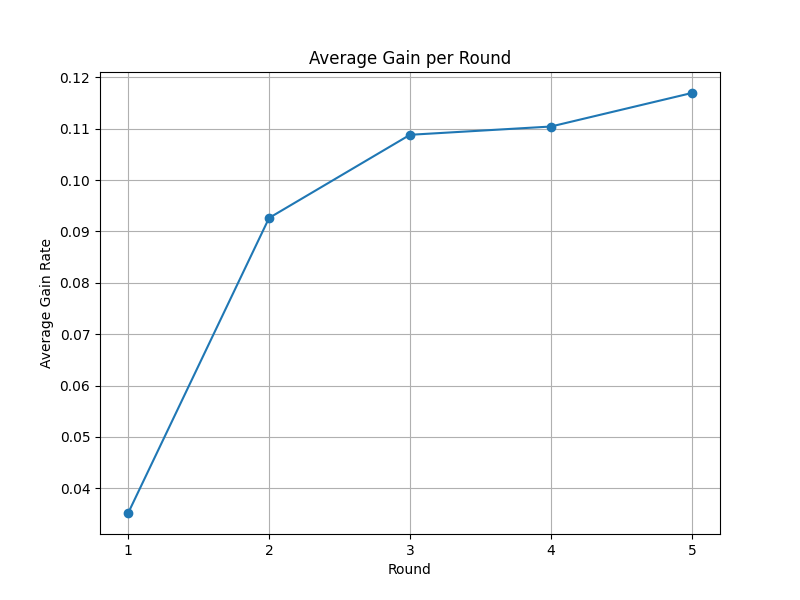

## AFE-Master Extended Experiment Results

#### Regression Tasks

| Method    | optiver | abalone | bike   | crab   | google | flood  | Avg        |
| --------- | ------- | ------- | ------ | ------ | ------ | ------ | ---------- |
| qwen7b    | 7.55%   | 0.38%   | 12.26% | 0.59%  | 27.91% | 7.01%  | 9.28%      |
| o1-direct | 0.55%   | -0.19%  | -0.10% | -0.19% | -9.44% | -1.27% | -1.77%     |
| w/o ast   | 0.36%   | 0.34%   | 36.33% | 0.03%  | 20.41% | 1.91%  | 9.90%      |
| Ours      | 9.90%   | 1.39%   | 43.96% | 0.13%  | 54.08% | 7.01%  | **19.41%** |

#### Classification Tasks

| Method    | multi  | academic | disease | kidney | smoke  | soft   | spac  | Avg       |
| --------- | ------ | -------- | ------- | ------ | ------ | ------ | ----- | --------- |
| qwen7b    | -0.10% | 0.78%    | 6.85%   | 2.81%  | 0.50%  | 0.00%  | 0.25% | 1.58%     |
| o1-direct | -6.56% | -0.49%   | 12.06%  | -5.65% | -0.46% | -0.11% | 2.81% | 0.23%     |
| w/o ast   | -1.87% | 1.39%    | 10.32%  | -7.09% | 0.25%  | 0.00%  | 0.45% | 0.49%     |
| Ours      | 0.31%  | 2.74%    | 20.64%  | 23.15% | 0.46%  | 2.11%  | 1.10% | **7.22%** |

#### TabPFN

| Method | academic  | disease    | kidney    | spac      | Avg       |
| ------ | --------- | ---------- | --------- | --------- | --------- |
| OpenFE | -0.33%    | -4.48%     | **4.33%** | 1.72%     | 0.31%     |
| CAAFE  | -1.57%    | -3.01%     | -2.89%    | 1.32%     | -1.54%    |
| OCTree | -0.50%    | 4.45%      | 2.89%     | 1.17%     | 2.00%     |
| Ours   | **0.29%** | **17.90%** | **4.33%** | **2.23%** | **6.19%** |

#### Average Gain per Round

